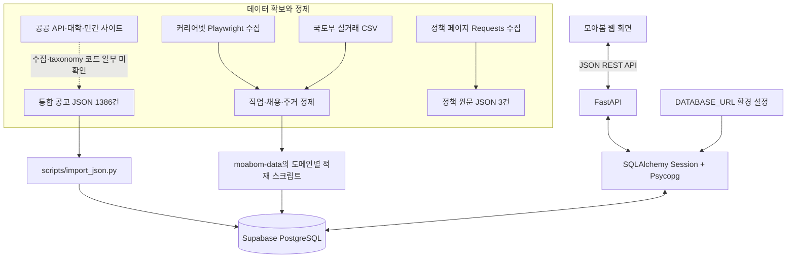
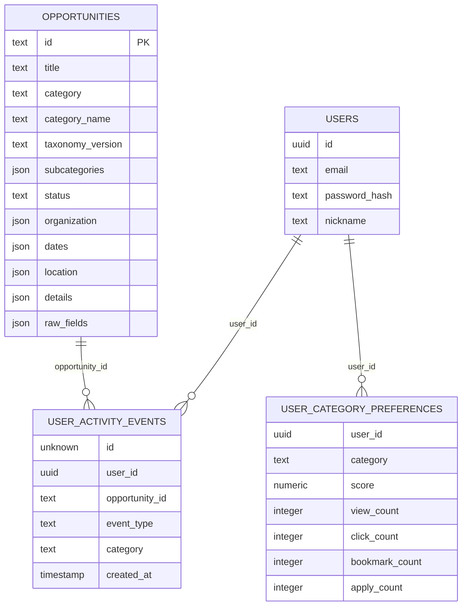

# 모아봄 백엔드 포트폴리오 검토안

> 검토 기준일: 2026-10-08, Asia/Seoul. README에 옮기기 전 검토하는 문서입니다.
> 근거: 백엔드 전체 Python 코드, requirements, JSON 결과물, 형제 폴더 `moabom-data`의 Python 코드 11개와 데이터 파일, 사용자가 제공한 계획서 6쪽과 서비스 화면 5장.
> 숫자는 로컬 파일의 집계입니다. 실제 서비스 DB의 저장 건수나 성능을 측정한 값은 아닙니다.

## 1. README에 추가로 담으면 좋은 내용

기술 스택·DB·크롤링 외에 다음 항목을 설명하면 백엔드 개발자로서의 설계와 기여가 더 잘 보입니다.

| 항목 | 설명할 내용 | 현재 근거 |
| --- | --- | --- |
| 문제와 설계의 연결 | 청년의 학습·실무·정착 정보를 공통 데이터 모델로 연결 | 계획서, `opportunities`와 도메인별 API |
| 본인 기여 | API·DB 설계·백엔드 단독 구현, 크롤링·정제는 팀원과 2인 공동 작업 | 사용자 확인 |
| 추천 로직 | 조회·클릭·북마크·지원의 가중치, 지역 우선순위, 신규 사용자 처리 | `user_events.py`, `recommendations.py` |
| 인증과 권한 | 비밀번호 해시 구현 범위, 인증 토큰과 사용자 식별의 후속 과제 | `auth.py`, `security.py`, `schemas.py` |
| API 계약 | 검색·필터·페이지네이션·응답 구조·예외 처리·OpenAPI | `main.py`, 라우터 6개 |
| 주거 데이터 활용 | CSV 인코딩 대응, 원 단위 통일, 계약일 복원, SQL 평균·중앙값 비교 | `moabom-data`, `housing.py` |
| 데이터 품질 | 중복 ID, 누락 필드, 출처·원문 보존, 분류 근거, 오래된 상태 | JSON 감사 결과 |
| 재적재와 운영 | ID 기반 upsert, 트랜잭션, DB 헬스체크, 갱신·실패 대응 | 적재 스크립트, `/health/db` |
| 검증 | 정제 재현 결과, 회귀 검사, 실제 DB 확인의 한계 | 이 문서의 검증 항목 |
| 배포·성과 | 백엔드 호스팅, 자동화 설정, 응답 시간, 사용·클릭 지표 | 추가 자료 필요 |

## 2. 포트폴리오 소개 문장 초안

춘천 청년이 여러 기관과 대학 홈페이지를 방문하며 교육·채용·지원 정책을 찾아야 하는 정보 분산 문제를 해결하기 위해 청년 기회 통합 플랫폼 **모아봄**을 개발했습니다. API와 데이터베이스 설계를 포함한 백엔드를 단독 구현하고, 크롤링과 데이터 정제는 팀원과 공동 수행했습니다.

15개 출처의 공고·정책 데이터 1,386건을 공통 모델과 9개 카테고리로 제공하며, 사용자 행동과 지역 우선순위를 결합한 추천 API를 구현했습니다. 별도 데이터 파이프라인에서는 직업 정보 12건, 민간 채용 50건, 춘천·서울 주거 거래 246,166건의 정제 결과를 확인했습니다. 주거 데이터는 금액 단위와 날짜·주소 구조를 통일하여 지역 비교 API에서 활용하도록 구성했습니다.

이 문장에 등장하는 결과물 규모는 로컬 스냅샷 기준입니다. 이용자의 정보 탐색 시간 단축이나 청년 정착률 개선은 서비스의 목표이며, 측정된 성과로 표기하려면 별도 검증이 필요합니다.

## 3. 실제 기술 스택

| 영역 | 확인한 기술 | 쓰임과 근거 |
| --- | --- | --- |
| 언어 | Python, 로컬 백엔드 실행 환경 3.14.4 | API, 수집·정제·적재 |
| 웹 API | FastAPI 0.140.0 | 요청 라우팅, Depends, Query 검증, 자동 OpenAPI |
| 서버 | Uvicorn 0.51.0 | requirements에 선언된 ASGI 서버 |
| 입력 검증 | Pydantic 2.13.4, email-validator 2.3.0 | 이메일, UUID, 비밀번호 길이, 행동 enum |
| 설정 | pydantic-settings 2.14.2, python-dotenv 1.2.2 | `.env`의 `DATABASE_URL` 로딩 |
| DB 제공 플랫폼 | Supabase | 로컬 설정의 DB 호스트가 Supabase 제공 도메인임을 확인 |
| DB 엔진 | PostgreSQL | PostgreSQL 전용 upsert, JSONB 연산, ILIKE, 집계 SQL |
| DB 접근 | SQLAlchemy 2.0.51, Psycopg 3.3.4 | 커넥션·세션 관리, 바인딩된 SQL 실행 |
| 비밀번호 | pwdlib 0.3.0, argon2-cffi 25.1.0 | `PasswordHash.recommended()`와 해시 검증 |
| 동적 웹 수집 | Playwright 1.61.0, Chromium, BeautifulSoup 4.15.0 | 커리어넷 페이지 렌더링·파싱 |
| 정적 웹 수집 | Requests 2.34.2, BeautifulSoup | 정책 페이지 HTTP 수집·본문 추출 |
| CSV 처리 | pandas 3.0.5 | 국토부 CSV 인코딩·헤더·구분자 대응 |
| 프론트 배포 단서 | Vercel 도메인 | 스크린샷과 CORS 허용 목록에서 확인 |

백엔드 버전은 `requirements.txt`, 수집 라이브러리 버전은 `moabom-data/.venv`의 설치 메타데이터 기준입니다. 데이터 폴더의 requirements에는 pandas·requests·beautifulsoup4·playwright가 빠져 있어 신규 환경에서 그대로 재현하기 어렵습니다.

SQLAlchemy의 Session을 사용하지만, 도메인 모델과 ORM 관계를 선언한 구조는 아닙니다. 대부분의 API는 `text()`로 SQL을 직접 실행하고, 통합 공고 적재는 SQLAlchemy Core의 Table과 PostgreSQL insert를 사용합니다.

계획서에 기재된 Spring Boot/NestJS, Kotlin/Jsoup, Redis, GitHub Actions 스케줄러의 구현은 검토한 두 폴더에서 확인되지 않았습니다. Next.js/React는 계획서에 등장하지만 프론트 소스가 없어 실제 사용 여부를 확정하지 않았습니다.

## 4. 시스템과 데이터 연결 구조

실제 요청 연결은 `웹 화면 → FastAPI → Depends(get_db) → SQLAlchemy Session → Psycopg → PostgreSQL`입니다. Supabase SDK나 Supabase REST API를 호출하는 방식이 아니라 DB 접속 URL로 직접 연결합니다. Supabase Auth 연동도 확인되지 않았습니다.

`app/config.py`가 설정을 로딩·캐싱하고, `app/database.py`가 engine과 SessionLocal을 생성합니다. `pool_pre_ping=True`로 사용 전 연결 상태를 점검하고, 요청 종료 시 `get_db()`의 finally에서 세션을 닫습니다. CORS에는 개발용 주소와 실제 프론트 도메인이 등록되어 있습니다.

DB 조회를 실제로 시도했으나 Supabase가 `tenant/user not found`를 반환했습니다. 사용자가 다시 연결한 뒤에도 같은 오류가 있었고, 제공한 프로젝트 ID가 기존 접속 URL의 프로젝트 식별자와 일치함을 확인했습니다. 요청에 따라 기존 연결 설정은 유지했습니다. 접속 계정·프로젝트·접속 엔드포인트 상태를 다시 확인해야 합니다. 이에 실제 DDL, 외래키, 인덱스, RLS 정책, 저장 건수는 검증하지 못했습니다. 연결 복구 후 [읽기 전용 확인 SQL](db-inspection.sql)로 검증할 수 있습니다.

## 5. DB 테이블과 관계

아래는 **SQL과 입력 스키마에서 복원한 논리 관계**입니다. 선은 코드에서 사용하는 식별자 관계를 나타내며, 실제 DB의 외래키 생성 여부를 뜻하지 않습니다. UUID 표기는 API 입력·응답 스키마에서 추정한 타입입니다.

`opportunities.category`와 `user_category_preferences.category`는 추천 JOIN의 기준입니다. `ON CONFLICT(user_id, category)`가 실행되려면 선호도 테이블에 해당 조합의 unique 제약 또는 적절한 unique 인덱스가 필요합니다. 실제 생성 여부는 확인이 필요합니다.

| 테이블 | 역할 | 코드에서 확인되는 주요 필드 |
| --- | --- | --- |
| `opportunities` | 다양한 출처의 통합 공고 | ID·제목·요약·분류·상태·기관·대상·주제·지역·출처·이미지·상세·원문·날짜 |
| `users` | 자체 회원가입과 비밀번호 확인 | ID·이메일·해시·닉네임·생성/갱신일 |
| `user_activity_events` | 행동 원본 이력 | 사용자·공고·행동종류·카테고리·발생시각 |
| `user_category_preferences` | 사용자별 분류 선호 집계 | 사용자·분류·점수·행동별 횟수·갱신일 |
| `career_jobs` | 직업 탐색 | 직업명·설명·관련직업·능력·적성·흥미·학과·자격·직업코드·출처·검증상태 |
| `job_postings` | 실제 민간 채용 | 회사·직무/코드·인원·고용형태·급여·학력·경력·주소·모집일·출처 |
| `housing_transactions` | 전월세 거래와 지역 비교 | 지역·건물·유형·면적·층·건축연도·계약일·전월세구분·보증금·월세·출처 |

통합 공고는 공통 검색·정렬 필드를 별도 컬럼으로 두고, 기관·대상·세부 정보·원문을 JSON으로 보존하는 혼합 구조입니다. 예를 들어 JSON `dates.recruit_end_at`을 별도 `recruit_end_at` 컬럼으로도 변환해 날짜 정렬에 사용합니다. importer의 JSON 선언만으로 실제 DB 컬럼이 JSON인지 JSONB인지 확정할 수는 없습니다.

직업·채용·주거는 전용 테이블과 조회 API로 나뉩니다. 직업 코드와 채용 직무 코드가 있지만 이들을 연결하는 JOIN이나 실제 FK는 현재 코드에 없습니다. 코드 체계를 확인한 후 직업 탐색에서 채용으로 연결하는 기능을 추가할 수 있습니다.

이 저장소의 Table 선언은 적재용 메타데이터입니다. `create_all()`, CREATE TABLE 스크립트, Alembic migration이 없으므로 빈 DB에 테이블을 자동 생성하는 프로젝트는 아닙니다.

## 6. 구현된 API

OpenAPI 생성으로 확인한 업무 API는 12개이며, 루트·헬스체크 3개가 별도로 있습니다.

| 메서드 | 경로 | 기능 |
| --- | --- | --- |
| GET | `/api/opportunities` | 분류·상태·키워드 검색, 페이지네이션 |
| GET | `/api/opportunities/{opportunity_id}` | 공고 상세 |
| POST | `/api/auth/signup` | 이메일 중복 확인, 비밀번호 해시 저장 |
| POST | `/api/auth/login` | 비밀번호 검증, 사용자 정보 반환 |
| POST | `/api/user-events` | VIEW/CLICK/BOOKMARK/APPLY 이력·선호도 누적 |
| GET | `/api/recommendations` | 사용자·분류 기준 추천과 점수 반환 |
| GET | `/api/career-jobs` | 직업명·설명 검색, 관련 학과 JSONB 필터 |
| GET | `/api/career-jobs/{career_job_id}` | 직업 상세 |
| GET | `/api/job-postings` | 채용 검색, 고용형태·모집중 필터 |
| GET | `/api/job-postings/{posting_id}` | 채용 상세 |
| GET | `/api/housing/transactions` | 지역·주택유형·거래유형·면적 필터 |
| GET | `/api/housing/compare` | 춘천·서울 표본수, 평균·중앙값 보증금/월세, 평균면적 |

공통 목록 응답은 `items`, `pagination`, `filters`로 구성됩니다. 목록 크기에는 상한을 두고, 사용자 입력을 SQL 파라미터로 바인딩합니다. 주거 비교는 PostgreSQL의 `AVG`, `FILTER`, `PERCENTILE_CONT(0.5)`로 집계합니다.

화면 검색 안내에는 주관기관이 등장하지만 통합 공고 검색 SQL은 `title`, `summary`, `source`를 대상으로 합니다. `organization.name` 검색과 사용자가 선택하는 정렬 파라미터는 아직 없습니다. 인턴은 화면에 별도 탭이 있으나 통합 JSON의 최상위 분류는 아래의 9개입니다.

## 7. 사용자 행동과 추천

| 행동 | 선호도 증가 |
| --- | ---: |
| 조회 VIEW | 1 |
| 원문 클릭 CLICK | 3 |
| 북마크 BOOKMARK | 5 |
| 지원 APPLY | 8 |

행동 기록 시 공고를 조회해 카테고리를 확보하고, 이벤트 INSERT와 카테고리 집계 upsert를 같은 세션에서 수행합니다. 둘 중 하나가 실패하면 rollback합니다. 예를 들어 같은 분류에서 조회 1회·클릭 1회·북마크 1회이면 선호 점수는 9입니다.

추천 점수는 `preference_score + region_score`입니다.

| 공고 유형 | 지역 점수 |
| --- | --- |
| 공모전·해커톤 | 전국/온라인 10, 춘천 7, 강원 5, 기타 2 |
| 다른 분류 | 춘천 10, 강원 6, 전국/온라인 3, 기타 0 |

지역 판단은 지역 JSON을 문자열로 변환한 값과 제목·요약의 키워드로 수행합니다. 공모전·해커톤의 강원 5점 조건은 지역 JSON만 검사합니다. 선호 이력이 없는 사용자는 LEFT JOIN과 COALESCE로 선호 점수 0을 받아 지역 점수로 정렬됩니다.

`CLOSED`는 제외하고, 점수 → 상태 → 마감일 → 게시일 → ID 순서로 정렬합니다. 이 추천은 규칙 기반이며 모델 학습·LLM 호출 코드가 없습니다. 화면의 AI 맞춤 90%·96%나 1초 로드맵 완성과 연결되는 계산은 이 저장소에서 확인되지 않았습니다.

## 8. 통합 공고 정제 결과와 적재

15개 출처 이름, 9개 분류, 1,386개 고유 ID가 확인되었습니다. 수집 시점은 2026-07-25~07-29입니다. 상세 결과는 [공고 감사 JSON](data-audit.json), 수집·정제 코드 설명은 [데이터 파이프라인 검토안](data-pipeline-review.md)에 정리했습니다.

| 출처 | 건수 | 출처 | 건수 |
| --- | ---: | --- | ---: |
| 온통청년 청년정책 Open API | 405 | 나라장터 입찰공고 API | 333 |
| 강원대학교 일반공지 | 165 | 링커리어 | 140 |
| 춘천 문화축제 API | 99 | 보조금24 공공서비스 API | 67 |
| 위비티 | 60 | 한림대학교 일반공지 | 35 |
| 춘천 공연행사 API | 29 | 자원봉사센터 공지사항 | 12 |
| 춘천 경제포털 공공일자리 | 10 | 춘천 경제포털 채용정보 | 10 |
| 배워봄 | 9 | 자원봉사센터 교육 및 행사 | 7 |
| 춘천 관광지 API | 5 | **합계** | **1,386** |

| 분류 | 건수 | 분류 | 건수 |
| --- | ---: | --- | ---: |
| 사업·창업 STARTUP | 375 | 채용·일자리 JOB | 298 |
| 교육·강좌 EDUCATION | 235 | 행사·공연 EVENT | 159 |
| 지원금·정책 SUPPORT_POLICY | 147 | 공모전 CONTEST | 106 |
| 대외활동 ACTIVITY | 44 | 자원봉사 VOLUNTEER | 18 |
| 해커톤 HACKATHON | 4 | **합계** | **1,386** |

`taxonomy_version=2.0`은 전 건에 있습니다. `details.taxonomy`에는 기존 분류, 분류 방법, 매칭 단어, 이유, 신뢰도가 보존됩니다. 결과물에 기록된 분류 방법은 STRUCTURED 941건, MANUAL_RULE 420건, SOURCE 6건, KEYWORD 19건입니다. 이 수치는 메타데이터 집계이며 taxonomy 변환 프로그램을 직접 검증한 결과는 아닙니다.

`scripts/import_json.py`는 UTF-8 BOM을 허용해 배열을 읽고, ID·제목·분류를 검사합니다. 구형 문자열 category와 v2 객체 category를 모두 처리하며, ISO 날짜와 UTC Z를 datetime으로 변환하고, 빈 배열·객체를 기본값으로 채웁니다. `ON CONFLICT(id) DO UPDATE`로 공고를 재적재하며, 전체 적재는 `engine.begin()` 트랜잭션으로 감쌉니다. 잘못된 필드는 일부 건을 건너뛰지만 SQL 오류는 전체 트랜잭션을 중단합니다.

이번 검토에서 재적재의 UPDATE에 `category_name`, `taxonomy_version`, `subcategories`가 빠진 것을 발견했습니다. 동일 ID의 분류 변경이 갱신되도록 수정하고, 생성된 PostgreSQL upsert SQL을 검사하는 회귀 테스트를 추가했습니다. 원격 DB에는 실행하지 않았습니다.

## 9. 화면·계획서와 코드의 대응

| 자료에 등장하는 기능 | 검토 결과 |
| --- | --- |
| 통합 목록·분류·검색·상세·원문 링크 | API와 데이터 필드 확인 |
| 회원가입·로그인 | 자체 users 테이블·비밀번호 해시 확인 |
| 사용자 맞춤 추천 | 행동·지역 기반 규칙 추천 확인 |
| 학력·프로젝트 경험·희망 직무 설문 | 이 입력과 로드맵 생성 API는 두 폴더에서 미확인 |
| AI 합격 팁·개인 메모 저장·챗봇 | 관련 엔드포인트·모델 호출·메모 테이블 코드 미확인 |
| 별표 북마크 | BOOKMARK 행동 기록은 있으나 북마크 목록/해제 CRUD는 미확인 |
| 자동 수집·Redis 캐시·검색 인덱스 | 계획서에는 있으나 검토한 코드에서는 미확인 |
| 직업·민간 채용·서울/춘천 주거 비교 | 계획을 확장한 백엔드·데이터 처리 확인 |

화면의 101건은 촬영 당시 화면의 표시값입니다. 로컬 JSON 1,386건과 같은 필터·DB·시점을 가정할 수 없습니다. 미확인 기능이 실제 서비스에 없다는 뜻은 아니며, 프론트나 다른 저장소의 구현 자료가 필요합니다.

## 10. 개선·추가 확인 사항

| 우선순위 | 항목 | 이유와 다음 조치 |
| --- | --- | --- |
| 높음 | DB 연결·DDL 복원 | tenant/user 오류 해결 후 실제 테이블·FK·unique·인덱스·RLS 확인. schema/migration 파일을 버전 관리 |
| 높음 | 로그인 이후 사용자 인증 | 로그인은 토큰/세션 없이 사용자 정보만 반환. 행동·추천 API는 요청의 user_id를 신뢰하므로 인증 주체를 서버에서 검증해야 함 |
| 높음 | 모집 상태 갱신 | 로컬 OPEN 278건 중 240건이 기준일 이전 마감. 추천은 상태만 보고 마감 여부를 재계산하지 않음 |
| 높음 | 전체 수집·분류 코드 확보 | 두 폴더에 없는 대학·링커리어·위비티·공공 API 수집과 통합 taxonomy 변환은 사용자 설명에 따라 팀원 제공 결과로 구분. 원본 소스 확보 후 상세 과정 추가 |
| 중간 | 날짜 경계 통일 | 공고 모집일 중 205건은 날짜만 있어 naive datetime이 됨. KST·마감일 종료시각 정책 필요 |
| 중간 | 행동 재시도·북마크 해제 | 같은 이벤트를 반복하면 점수 계속 증가. 멱등키·북마크 상태·집계 정책과 점수 감쇠 검토 |
| 중간 | 기관 검색·정렬·응답 필드 | UI 요구와 검색 범위 일치, 정렬 옵션 추가. 추천 `o.*`에는 raw_fields가 포함되어 응답 크기 검토 |
| 중간 | 주거 데이터 계보·표본 편향 | 뒤바뀐 원본 파일명과 가격 변수 매칭 확인. 실제 DB 적재 파일·기간·표본 정책 기록 |
| 중간 | 데이터 적재 실패 대응 | moabom-data의 importer는 SQL 오류를 한 트랜잭션 내에서 잡고 계속함. savepoint 또는 배치 rollback 정책 필요 |
| 중간 | 데이터 품질 | 공고 원문 URL 133건·썸네일 1,038건 누락, 분류 LOW 345건. 검수 대상·기본 이미지·출처 링크 정책 정리 |
| 후속 | 운영·성과 근거 | 백엔드 배포 URL, 스케줄·로그·재시도, 부하/응답 측정, 서비스 사용 지표 확보 |

나라장터 333건은 STARTUP 375건의 대부분입니다. 입찰 공고가 청년에게 실제 참여 가능한 기회인지 면허·사업자·지역 조건을 함께 확인해야 하며, 모두 청년 창업 지원이라고 표현하지 않는 것이 정확합니다.

## 11. 검증과 GitHub 반영 범위

- 기존 백엔드 Python 파일 전체와 데이터 파이프라인 Python 11개를 읽고 구문을 확인했습니다.
- OpenAPI 생성과 업무 API 12개 등록을 확인했습니다.
- 통합 공고 1,386건 전부를 DB 쓰기 없이 normalize했으며 날짜 변환 경고는 없었습니다.
- v2 분류 변환·구형 분류 호환·재적재 SQL의 분류 메타데이터 갱신에 대한 unittest 3개가 통과했습니다.
- 직업 12건·채용 50건은 정제 함수를 실행한 결과와 저장 파일이 정확히 같았습니다.
- 주거 및 서울 매칭 표본 재현 검증은 [데이터 검토안](data-pipeline-review.md)에 기록했습니다.
- 실제 DB 연결과 통합 API 실행, 원격 데이터 적재는 검증하지 못했습니다. 외부 사이트 크롤링을 새로 수행하지 않았습니다.

검토 시작 당시 GitHub main과 로컬 HEAD는 `2a5eb5f`로 같았고, 작업 디렉터리에 아직 커밋하지 않은 변화가 있었습니다. 주요 변화는 12개 기존 공고 파일의 archive 이동, 통합 v2 파일 추가, importer의 새 분류 지원, 인증·행동 코드 주석 정리였습니다. config와 requirements의 변경 일부는 줄바꿈 차이였습니다.

archive의 11개 파일은 기존 Git 데이터와 내용이 같았습니다. 링커리어 archive는 기존 111건에서 30건으로 달라졌지만 기존 111개 ID는 모두 v2 140건에 포함되어 있습니다. 줄바꿈을 통일하고 `.DS_Store`를 제외했습니다.

`moabom-data`는 별도 로컬 폴더이며 Git 저장소가 아니었습니다. 해당 원본을 변경하거나 이 저장소로 대량 복사하지 않았습니다. 수집 코드까지 공개 포트폴리오에서 탐색하려면 그 폴더의 Git 관리·공개 범위를 정한 뒤 소스 링크를 추가하는 작업이 필요합니다.

## 12. 검토 후 README 구성 제안

`서비스 목적 → 담당 역할 → 확인된 결과물 → 기술 스택 → 전체 구조 → DB 논리 관계 → 수집·정제 사례 → API → 추천 로직 → 실행 방법 → 검증·한계 → 개선 계획` 순서로 편집하면 됩니다.

검토할 핵심은 본인 기여 표기, AI 기능의 구현 위치, 전체 공고 수집·taxonomy 코드 위치, 실제 DB 구조와 배포 정보, 주거 표본을 설명하는 방식입니다. 현재 README를 새로 작성하지 않았으며 이 검토안을 검토 후 반영할 수 있도록 준비했습니다.
