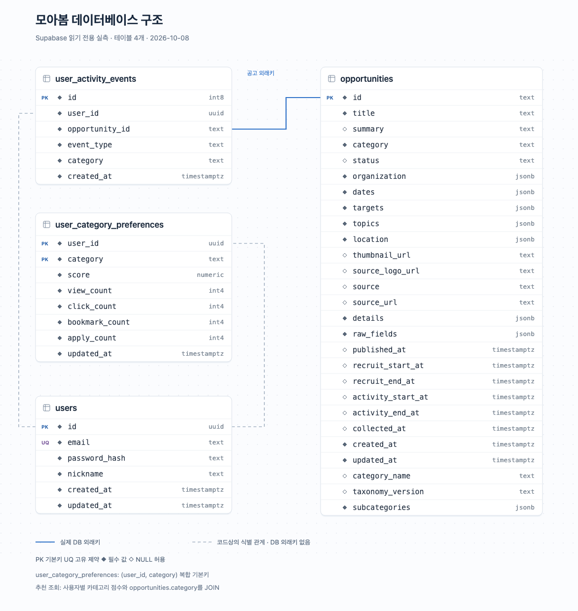
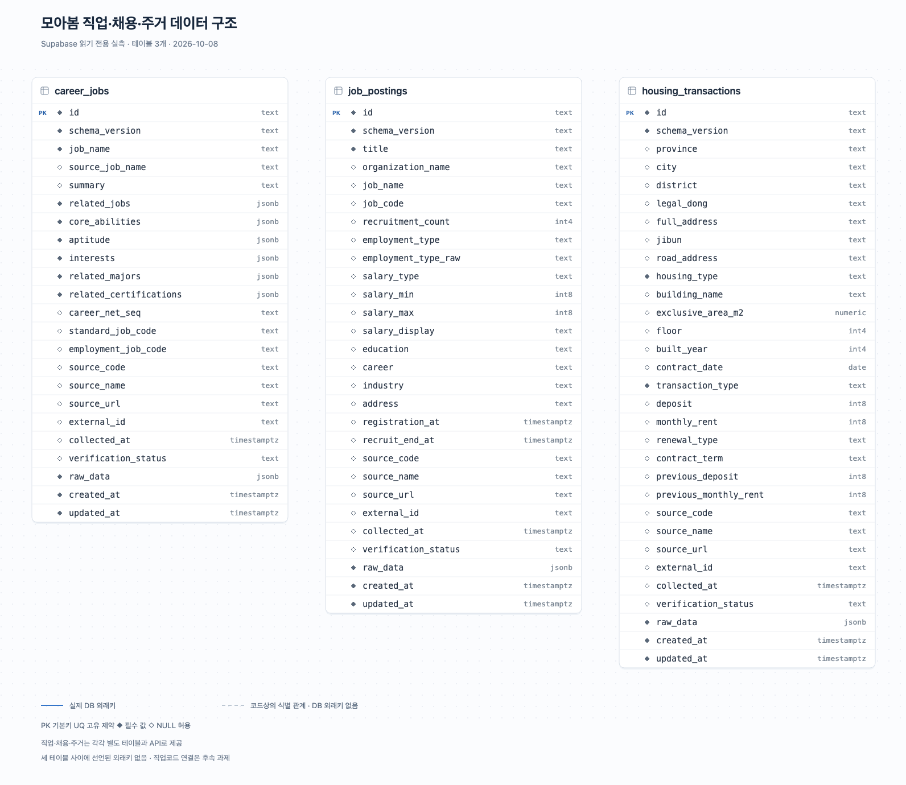

# 모아봄 데이터베이스 설계

2026-10-08, 기존 `DATABASE_URL`로 Supabase PostgreSQL에 접속하여 읽기 전용으로 확인했습니다. 아래 자료는 테이블 정의·제약·인덱스·공개 데이터 건수를 담으며 회원 레코드와 접속 비밀정보를 포함하지 않습니다. 기존 접속 설정과 DB는 변경하지 않았습니다.

## 연결 방식

`웹 화면 → FastAPI → Depends(get_db) → SQLAlchemy Session → Psycopg → Supabase Session pooler → PostgreSQL`

DB 연결은 `app/config.py`와 `app/database.py`에서 관리합니다. Supabase SDK·Supabase Auth를 사용하는 구조가 아니며 `DATABASE_URL`만 사용합니다. 브라우저용 publishable key·서버용 secret key·JWKS URL은 이 DB 연결을 대체하지 않습니다.

## 공고·회원·행동·선호도



[SVG 원본](images/database-schema.svg) · [구조도 입력 JSON](schema-snapshot.json)

| 테이블 | 주요 설계 | API 연결 |
| --- | --- | --- |
| `opportunities` | `id text` 기본키, 제목·분류·상태·날짜 컬럼과 출처별 JSONB 병행 | 목록·상세·추천·행동 기록의 공고 확인 |
| `users` | `id uuid` 기본키, 이메일 고유 제약, 비밀번호 해시 | 회원가입·로그인 |
| `user_activity_events` | `id int8` 기본키, 공고 외래키, 사용자·분류·행동·시각 | 행동 이력 INSERT |
| `user_category_preferences` | `(user_id uuid, category text)` 복합 기본키, 점수·행동별 횟수 | 선호도 upsert·추천 JOIN |

실제 FK는 `user_activity_events.opportunity_id → opportunities.id` 한 개이며 `ON DELETE CASCADE`입니다. 회원 테이블과 행동·선호도의 `user_id` 관계에는 DB FK가 없습니다. 점선은 이 코드상의 관계를 나타냅니다. `category`도 FK로 연결하지 않으며 추천 조회에서 값으로 JOIN합니다.

DB의 행동 CHECK 제약은 `IMPRESSION`, `VIEW`, `CLICK`, `BOOKMARK`, `APPLY`를 허용합니다. 현재 API 요청 스키마와 가중치 로직은 `VIEW`, `CLICK`, `BOOKMARK`, `APPLY` 네 가지를 지원합니다.

공고의 `organization`, `dates`, `targets`, `topics`, `location`, `details`, `raw_fields`, `subcategories`는 실제 JSONB 컬럼입니다. 공통 목록에 필요한 속성을 컬럼으로 두고, 출처마다 다른 상세 값과 원문을 보존하는 구조입니다. JSON 날짜를 별도의 `timestamptz` 컬럼에도 적재하여 정렬에 사용합니다.

사용자가 제공한 화면과 현재 구조의 차이로 `opportunities.collected_at`은 실제 DB에서 NULL을 허용합니다. 구조도는 현재 DB 정의를 따랐습니다.

## 직업·채용·주거



[SVG 원본](images/domain-schema.svg) · [구조도 입력 JSON](domain-schema-snapshot.json)

| 테이블 | 구조와 조회 활용 | 실제 저장 건수 |
| --- | --- | ---: |
| `career_jobs` | 관련 학과·자격·능력 등을 JSONB 배열로 저장, 학과 포함 검색 | 12 |
| `job_postings` | 직무/코드·고용형태·급여·학력·경력·모집일을 컬럼으로 저장, 원문 JSONB 보존 | 50 |
| `housing_transactions` | 지역·유형·면적·계약일·원 단위 금액을 컬럼으로 저장, 원문 JSONB 보존 | 6,830 |

세 테이블은 각각 `id text` 기본키를 가지며 서로 연결하는 FK는 없습니다. 직업·채용의 코드도 현재 API에서 JOIN하지 않습니다. 주거의 면적은 `numeric`, 계약일은 `date`, 보증금·월세는 `int8`입니다.

주거 저장 데이터는 춘천 5,630건과 서울 주택유형별 300건씩 총 1,200건이며 해당 로컬 파일의 ID 집합과 DB가 일치했습니다. 전체 서울 정제 데이터 240,536건을 모두 적재한 것은 아닙니다.

## 확인한 제약과 인덱스

7개 테이블에 기본키가 있으며 선호도만 복합 기본키입니다. 전체 인덱스는 기본키·고유 제약 인덱스를 포함해 28개입니다.

| 대상 | 실제 인덱스 예시 | 연결되는 조회 |
| --- | --- | --- |
| 공고 | `category`, `(category, status)`, `subcategories` GIN | 분류·상태 필터, 하위 분류 확장 |
| 직업 | `related_majors`·`core_abilities` GIN, 직업코드·직업명 B-tree | JSONB 학과 필터, 직업 탐색 |
| 채용 | 직무코드·직무명·기관명·모집마감일 B-tree | 검색·모집중 필터 |
| 주거 | `(city, housing_type, contract_date)`, 거래유형·법정동 등 | 지역·주택유형·기간 조건 |
| 선호도 | `(user_id, category)` 고유 인덱스 | 사용자별 선호 조회·충돌 기준 |
| 회원 | `email` 고유, `lower(email)` 고유 인덱스 | 이메일 중복 검사·로그인 |

현재 `lower(email)` 고유 인덱스 두 개는 정의가 같아 중복 정리를 검토할 수 있습니다. 일반 B-tree가 `ILIKE '%검색어%'`를 효율적으로 처리한다고 단정할 수 없으며, 검색 성능은 실행 계획과 측정으로 검증해야 합니다.

확인한 7개 테이블 모두 RLS가 비활성 상태입니다. 사용자 인증·권한 검증과 DB 접근 경로별 권한 정책을 후속으로 정리해야 합니다. 이번 작업에서 정책이나 제약을 추가하지 않았습니다.

## 연결 오류를 다시 만났을 때

현재 기존 Session pooler 연결로 정상 조회되었습니다. 이전 `tenant/user not found` 오류의 정확한 원인은 이 결과만으로 확정할 수 없습니다.

Supabase의 해당 오류 안내는 pooler 호스트와 사용자 이름 조합을 프로젝트에 매핑할 수 있는지 확인하도록 설명합니다. **Dashboard → Connect → Session pooler**에서 표시되는 호스트·포트·사용자 이름을 함께 복사해 확인합니다. `aws-0`·`aws-1`이나 리전은 추측해서 바꾸지 않습니다. [Supabase 오류 안내](https://supabase.com/docs/guides/troubleshooting/tenant-or-user-not-found)

`db.<project-ref>.supabase.co:5432`, 사용자 `postgres`는 Direct connection 정보입니다. Session pooler의 호스트와 `postgres.<project-ref>` 사용자와는 다른 연결 방식입니다. Direct connection은 기본적으로 IPv6 연결이며, 사용 환경에 따라 IPv4 Session pooler가 필요할 수 있습니다. [Supabase PostgreSQL 연결 문서](https://supabase.com/docs/guides/database/connecting-to-postgres)

## 재확인과 구조도 갱신

[읽기 전용 확인 SQL](db-inspection.sql)을 Supabase SQL Editor 또는 DB 클라이언트에서 실행하여 메타데이터를 확인할 수 있습니다. 이번 실측 결과는 [database-schema.json](database-schema.json), GET 함수 실행 결과는 [live-read-validation.json](live-read-validation.json)에 저장했습니다.

구조도용 JSON을 최신 메타데이터와 일치하도록 갱신한 뒤 저장소 루트에서 실행합니다.

```bash
python3 scripts/render_schema_diagram.py
python3 scripts/render_schema_diagram.py --input docs/domain-schema-snapshot.json --output docs/images/domain-schema.svg
```

렌더러는 Python 표준 라이브러리로 SVG를 만듭니다. README용 PNG는 SVG를 로컬 브라우저에서 렌더링하고 글자·관계선·범례를 시각 검수한 결과입니다. JSON 스냅샷은 migration 파일이 아니며, 빈 DB 복원에 사용할 DDL은 별도로 관리해야 합니다.
